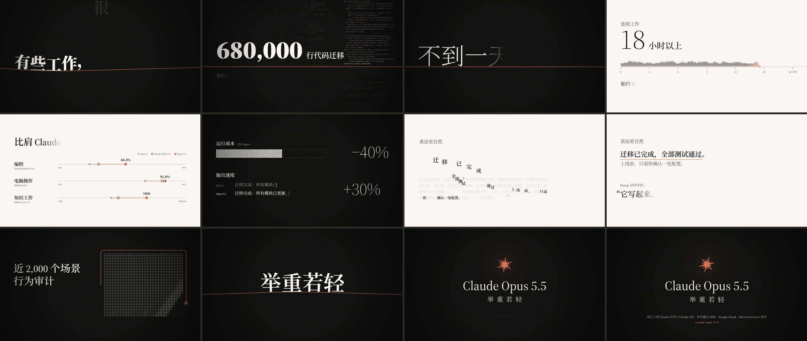

# Claude Opus 5.5 · 60 秒宣传片「举重若轻」

**在线观看：https://juyi404.github.io/opus55-promo/**

整部片子由代码生成。画面是一张 1920×1080 的 canvas，`window.__render(t)` 对任意时刻 t 确定性地画出一帧；canvas 以 float16 精度合成，出帧时才一次性量化成带抖动的 8 位 yuv420p，所以暗部的光晕和暗角不会出现色带。音效用 numpy/scipy 合成；配乐和男声旁白由 Cardinal AIGC 生成，女声旁白是 edge-tts 的晓晓。第一版的配乐也是 numpy/scipy 合成的，成片留在 `out/v1_synth/`。

非 Anthropic 官方作品，片中信息以官方发布为准。



## 网页版

网页里放的不是视频：浏览器跟着音频的时间，用渲染成片的同一份代码，一帧一帧实时画出来。

- 空格或 K 播放/暂停，F 全屏，←/→ 逐帧（按住 Shift 每次走 1 秒），Home 回到开头；点画面也能播放/暂停
- 下拉框切换配音：Cardinal 男声、晓晓女声、仅配乐，切换时停在原来的位置
- 网址参数：`?voice=cardinal|xiaoxiao|music` 选配音；`?t=秒数` 从这一刻打开，跳过开始页，例如 `?voice=xiaoxiao&t=30`
- 手机上横屏看画面最大；浏览器不支持页面全屏时，全屏按钮不显示

`docs/` 就是网页版，GitHub Pages 直接发布这个目录（main 分支 `/docs`）。它由 `node render/render.mjs site` 从 `src/` 生成，不要手改，约 1 分钟：

1. 把整部片子的 3601 帧全画一遍，收集用到的字形，加上 ASCII 和开始页的字，共 297 个。只拷贝含有这些字形的字体分片（113 个里的 19 个，约 1.4 MB），并把字形列在页面上，让它们一开始就一起加载
2. 三个混音转成 AAC 192k，共约 4.3 MB
3. 截 58 秒的片尾画面，做链接分享时的预览图 `poster.jpg`
4. 打开生成好的 `docs/`，每 0.5 秒取一帧（共 121 帧），按 float16 全精度逐像素算哈希，和 `src/` 对比，有一帧不同就报错

整站约 5.8 MB。

## 成片（out/）

| 文件 | 内容 |
|---|---|
| `opus55_promo.mp4` | Cardinal 男声旁白 + Cardinal 配乐（主版） |
| `opus55_promo_xiaoxiao.mp4` | 晓晓女声旁白 + Cardinal 配乐 |
| `opus55_promo_music_only.mp4` | 只有 Cardinal 配乐和音效 |
| `opus55_video.mp4` | 无声画面 |
| `v1_synth/opus55_promo.mp4` | 第一版：合成配乐 + 晓晓旁白 |
| `v1_synth/opus55_promo_yunjian.mp4` | 第一版：合成配乐 + 云健男声旁白 |
| `v1_synth/opus55_promo_music_only.mp4` | 第一版：只有合成配乐和音效 |
| `opus55_contact_sheet.png` | 12 帧缩略图，方便快速浏览 |

1920×1080，60 fps，H.264（x264 slow、tune film、CRF 16、aq-mode 3；BT.709 limited range），AAC 256k。每个 MP4 约 27 MB，没有放进仓库，按下面的步骤生成。

响度：每个混音做到 −14 LUFS（BS.1770），真峰值上限 −1.5 dBTP。编码成 AAC 后实测 −14.0 到 −14.1 LUFS，真峰值 −1.1 到 −1.6 dBTP（AAC 编码会让峰值稍微上冲）。

## 结构

| 时间 | 场景 | 旁白 |
|---|---|---|
| 0–4 s | S1 | 有些工作，很重。 |
| 4–12 s | S2 | 六十八万行代码迁移，团队预估要几周。它，不到一天。 |
| 12–18 s | S3 | 连续工作十八小时以上，始终专注于任务。 |
| 18–26 s | S4 | 编程、电脑操作、知识工作，比肩 Claude Fable 5.1。 |
| 26–34 s | S5 | 运行成本比 Opus 5 低四成，输出速度快三成以上。 |
| 34–44 s | S6 | 表达更自然，重要的事，先说。Ramp 这样评价：它写起来，像一位好同事。 |
| 44–50 s | S7 | 近两千个场景的行为审计，交出迄今最好的成绩。 |
| 50–60 s | S8 | 举重若轻。Claude Opus 5.5。 |

## 目录

- `src/cues.json`：场景边界，以及每句旁白的文字和起始时刻
- `src/scenes/s1.js … s8.js`：各场景的绘制，`draw(ctx, t, sc, k)`
- `src/lib.js`、`src/film.js`、`src/index.html`：公共绘图工具、入口（渲染和网页播放器共用）和页面
- `audio/synth.py`：配乐、音效和混音共用的合成工具（振荡器、包络、滤波、混响和各个乐器）
- `audio/vo.py`：用 edge-tts 生成晓晓、云健旁白，写到 `audio/vo/<voice>/`
- `audio/events.mjs`：从场景代码算出每个音效的触发时刻，写到 `audio/build/events.json`
- `audio/score.py`：第一版的合成配乐，写到 `audio/build/music.wav`
- `audio/cardinal/`：Cardinal AIGC 生成的原始素材：60 秒配乐 `music.mp3`、整段旁白一次读完的 `voice.wav`，以及生成它们的请求 `*_request.json`
- `audio/cardinal.py`：把 Cardinal 素材对上画面：旁白按 `cues.json` 切成一句一句，写到 `audio/vo/cardinal/`；配乐按段落对齐画面，写到 `audio/build/music_cardinal.wav`
- `audio/sfx.py`：音效，每套配乐一份（音高跟着配乐走），写到 `audio/build/sfx.wav` 和 `sfx_cardinal.wav`
- `audio/mix.py`：混音和母带，六个混音写到 `audio/build/mix_*.wav`
- `render/render.mjs`：逐帧渲染、封装和生成网页版；`render/serve.mjs`：本地静态服务，渲染时也负责把页面发来的帧转交给 ffmpeg
- `docs/`：网页版，由 `render.mjs site` 生成

## 预览

```bash
node render/serve.mjs 5173
```

然后打开 http://127.0.0.1:5173/ （会跳转到 `src/`，直接读 `audio/build/` 里的 wav），或者 http://127.0.0.1:5173/docs/ 看生成好的网页版。按键和网页版一样。

## 修改后重新生成

从头生成全部声音（新克隆的仓库也是这个顺序）：

```bash
.venv/Scripts/python.exe audio/vo.py        # 晓晓、云健旁白（edge-tts，要联网）
node audio/events.mjs                        # 音效的触发时刻
.venv/Scripts/python.exe audio/score.py      # 合成配乐；S1 开头的低音铺底 Cardinal 版也用它
.venv/Scripts/python.exe audio/cardinal.py   # Cardinal 配乐和男声旁白对上画面
.venv/Scripts/python.exe audio/sfx.py        # 两套音效
.venv/Scripts/python.exe audio/mix.py        # 六个混音
```

只改了哪一步，就从那一步往下重跑：改了画面或 `cues.json` 里的时间（画面和音效都跟着 cue 走），从 `events.mjs` 开始；改了合成配乐，从 `score.py` 开始。`audio/cardinal/` 里的素材是花 Cardinal token 生成的，`cardinal.py` 只做对齐，重跑不花钱；改了旁白文字才需要重新生成男声旁白（花 token），晓晓、云健重跑 `vo.py` 即可。

渲染：

```bash
node render/render.mjs video 10       # 渲染画面（10 个并行 worker，约 3 分钟），并封装全部版本
node render/render.mjs mux            # 只改了声音时，用现有画面重新封装
node render/render.mjs site           # 生成网页版 docs/
node render/render.mjs stills 2.5 30  # 截几张静帧（16 位 PNG）到 render/tmp/
```

渲染时每个 worker 开一个无头 Chrome，负责一段连续的帧：页面画完一帧，自己换算成带固定抖动的 8 位 BT.709 yuv420p，把原始字节 POST 给 `render/serve.mjs`，服务再写进这个 worker 的 ffmpeg。x264 用 `-tune film` 和 `aq-mode=3`，抖动在暗部能保留下来；别换成 `-tune grain`，它在这部片子的暗色渐变上反而让色带更明显。

两处保证每一帧确定的细节：

- 无头 Chrome 带 `--disable-accelerated-2d-canvas`，canvas 从第一帧起就在 CPU 上光栅化。不然 Chrome 会在几次 `getImageData`/`toDataURL` 读回之后，把 canvas 从 GPU 挪到 CPU，两边的文字抗锯齿不一样，每个 worker 的头几帧就和后面的对不上
- 字体要在画第一帧之前全部加载完。S1 和 S8 按「字 + 字体」缓存字形的下沉量（`actualBoundingBoxDescent`），字体还没到就画的一帧会把后备字体的量度留在缓存里。以前就因为这个，52.5 秒的「若」「轻」低了 1 像素

## 环境

- Node.js：先运行 `npm install`
- Chrome：需要支持 float16 canvas（`colorType: 'float16'` 和 `getImageData` 的 `rgba-float16`），在 Chrome 153 上验证过。默认路径 `C:/Program Files/Google/Chrome/Application/chrome.exe`，也可以用环境变量 `CHROME` 指定。网页版在不支持 float16 的浏览器里也能放，只是按 8 位合成
- ffmpeg：需要在 PATH 里
- Python 虚拟环境 `.venv`，装 numpy、scipy、edge-tts：

```bash
python -m venv .venv
.venv/Scripts/pip install numpy scipy edge-tts
```
